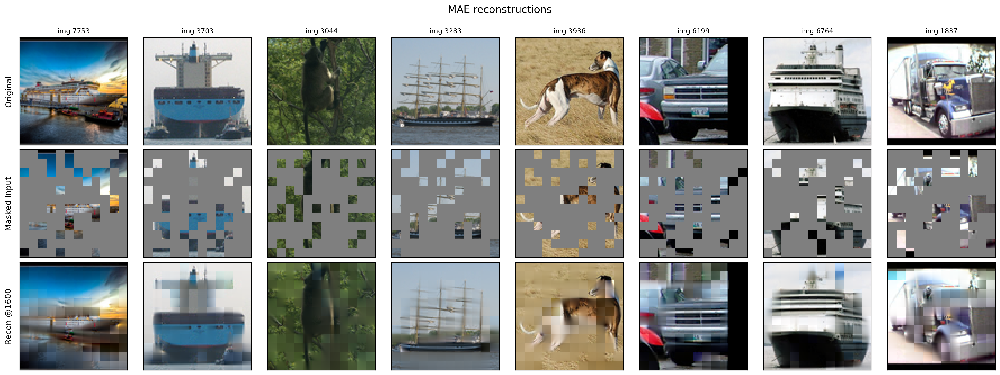

# Masked Autoencoders on STL-10

From-scratch MAE in raw PyTorch (no Lightning), trained on STL-10 for self-supervised visual representations.

[Project page](https://flamma7.github.io/mae-stl10/) · [Model weights](https://huggingface.co/flamma77/mae/tree/main/ViT-S-runpod)



## Approach

- **Model.** ViT-S encoder and an 8-layer decoder, trained with the MAE recipe (75% of patches masked).
- **Data.** STL-10: 100k unlabeled images for pretraining, 5k labeled for fine-tuning, 8k for test.
- **Training.** 1600 epochs on one RTX 5090 via RunPod. Reported results are from this run. The first implementation used DDP on Kaggle with 2× Tesla T4s.
- **Evaluation.** Linear probe, MLP probe, and fine-tuning the last transformer block plus a linear head (paper ablation).

Reconstruction quality largely plateaus after the first few hundred epochs — 100k images vs. the MAE paper’s 1.28M ImageNet-1K, plus a ViT-S encoder. Representation quality kept improving anyway, as in the paper.

## Repo layout

```
model.py              # MAE: ViT-S encoder + lightweight decoder
train_runpod.ipynb    # 5090 training on RunPod (source of reported results)
train_kaggle_ddp.py   # first implementation: Kaggle DDP on 2× GPUs
finetune.ipynb        # linear / MLP / last-block probes
finetune.py           # scripted version of finetune.ipynb
visualize.ipynb       # reconstruction grids across checkpoints
docs/                 # project page
```

There are two training scripts. Use `train_runpod.ipynb` for the 5090 setup; `train_kaggle_ddp.py` is the earlier DDP version.

## Learnings

- MAE spends most of training on local pixel detail once structure is in place, which is why JEPA-style SSL is appealing.
- MAE’s reported “base” learning rate is scaled by batch size. Using the base LR at batch 4096 made the effective LR about 16× too small.
- Turn masking off at fine-tune time and pass all patches to the classification head.
